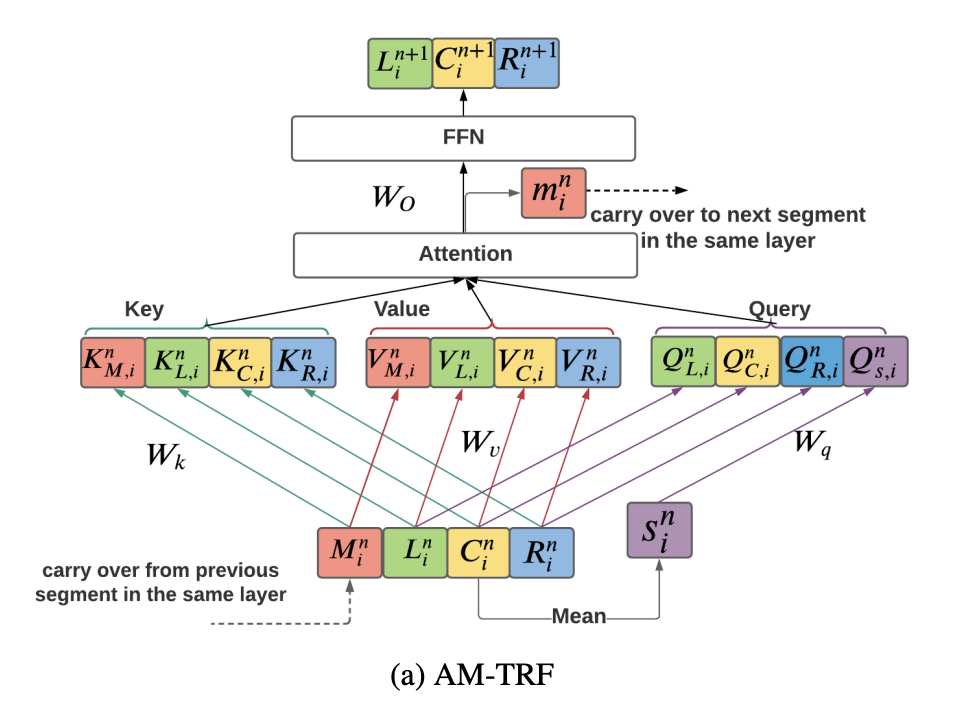

# Streaming Transformer-based Acoustic Models Using Self-attention with Augmented Memory
Paper link: https://arxiv.org/abs/2005.08042
<!-- This sentence uses `$` delimiters to show math inline:  $\sqrt{3x-1}+(1+x)^2$ -->

## idea of this paper
The idea of this is well explained in their follow up paper: [Emformer: Efficient Memory Transformer Based Acoustic Model For Low Latency Streaming Speech Recognition](https://arxiv.org/abs/2010.10759). Here borrow some figures from this paper.

     <!--  -->

There are several steps of this type of attention,

1. segmentation, the input will be segmented into $\textbf{C}_1^n,...,\textbf{C}_{I-1}^n$, where each segment contains $B$ frames
2. each segment will be concatenated with left and right context
3. each segment and layer will have a memory vector $m_i^n$ that will pass to the next segment 
4. to generate the memory vector, the mean pool is used to summarize the $C_i^n$ to get $s_i^n$, and $s_i^n=Attn(W_qS_i^n, K_i^n,V_i^n)$, where $Attn(.)$ is the attention mechanism
5. after all the AM-TRF layers, the center blocks are concatenated as the encoder output sequence, and the contextual blocks (left and right) are discarded

## some insights
The [Self-Attention Aligner: A Latency-Control End-to-End Model for ASR Using Self-Attention Network and Chunk-Hopping](https://arxiv.org/abs/1902.06450) used the trunk based idea and the left and right context serves as overlapping between different trunks (or segments). It's also interesting to see if there is any side-effect that the frames one segment has uneven number of keys and values to attend, other than the boundary effect, which is intended to solve by overlap.

On top of the trunk with overlap, a memory is added, intending to preseving context from previous segment, which is very interesting.

 

