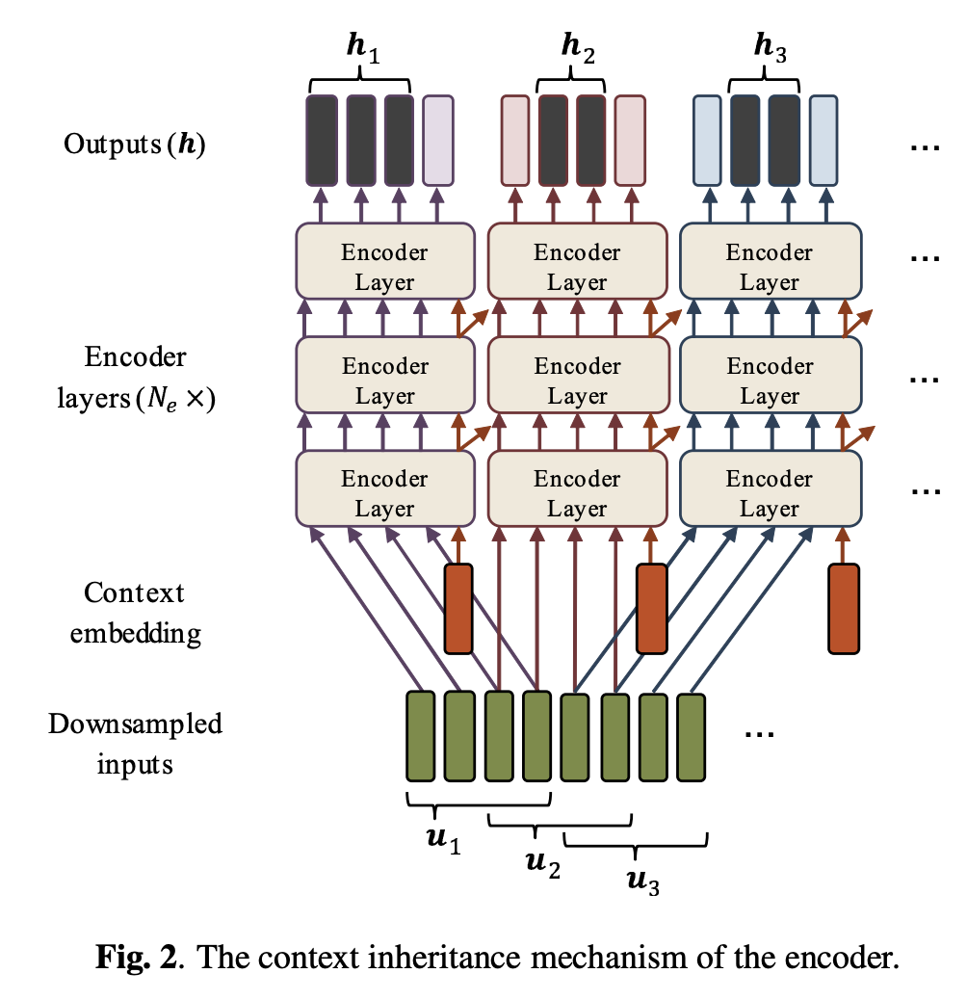

# Transformer ASR with Contextual Block Processing
Paper link: https://arxiv.org/abs/1910.07204

## idea of this paper
The core idea of the transformer is to add contextual information to when using blockwise transformer.

     <!--  -->

As self-attention in transformer used all information available, which makes the transformer needs to access future frames when processing current frame. To avoid this limitation, usually block processing was used. 

Although overlap between blocks can be used, block-based attention does not have a mechanism to preserve information from previous blocks, which is useful for long sequence modelling. The long sequence modelling capability is a key feature of recurrent based neural network (e.g. RNN, LSTM). The transformer is thought as a alternative of those RNNT networks, but with high parallel capability. 

The contextual block transformer then use an extra context embedding and process for each block, as an extra output. The extra contextual embedding is fed to upper layer when processing the next block. This lower layer contextual embedding solves the parallel processing problem.

The idea of this contextual embedding is very similar with [emformer](../emformer/emformer.md).

## some insights
There is a followup paper [Streaming Transformer ASR with Blockwise Synchronous Beam Search](https://arxiv.org/abs/2006.14941), and it focues on beam search decoder part of ASR.

## PyTorch Implementation
The implementation of the contextual block transformer can be found in ESPnet (https://github.com/jianboma/espnet/blob/master/espnet2/asr/encoder/contextual_block_transformer_encoder.py)

 

