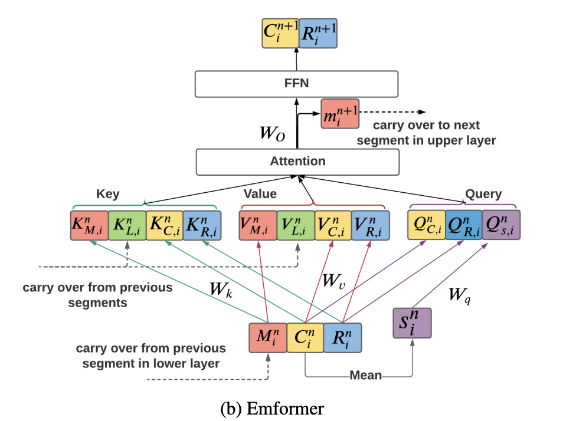

# Emformer: Efficient Memory Transformer Based Acoustic Model For Low Latency Streaming Speech Recognition
Paper link: https://arxiv.org/abs/2010.10759

## idea of this paper
This is a follow-up work of self-attention with augmented memory. Here borrow some figures from the emformer paper.

     <!--  -->

There are several improvements over the self-attention with augmented memory,

1. cache key and values from previous segment to avoid recompute of left contextual block for each segment
2. use memory vector from previous segments in lower layer to avoid sequential operating during training
3. disallow attention between the summary vector with the memory bank
4. use attention mask, and use hard copy of each segment's look-ahead context and puts the look-ahead context copy at the input sequence's beginning (how this can avoid look-ahead leaking?)

## some insights
For recognition or classification task, the segmentation effect or boundary effect may not be an issue. Still I think segmentation or trunk based streaming self-attention is not optimal for some audio processing task, like speech enhancement. But still need experiment to see how it works in other tasks. The memory usage should be quite interesting.

## PyTorch Implementation
PyTorch Implementation of emformer is: https://github.com/pytorch/audio/blob/main/torchaudio/models/emformer.py

 

